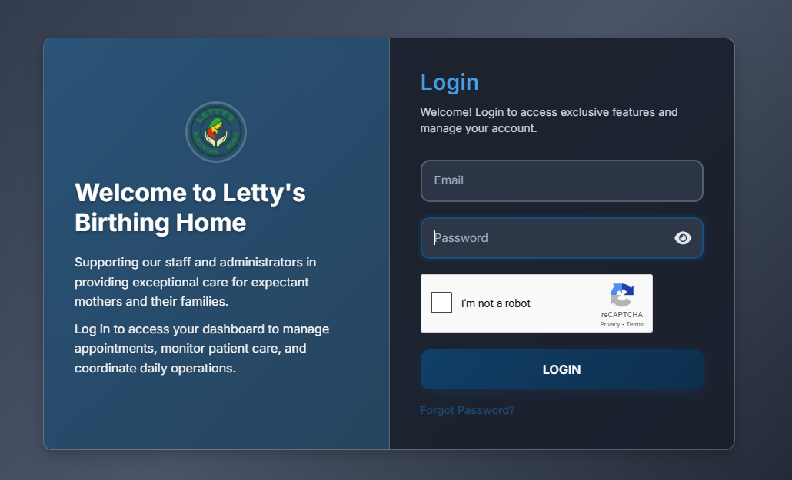
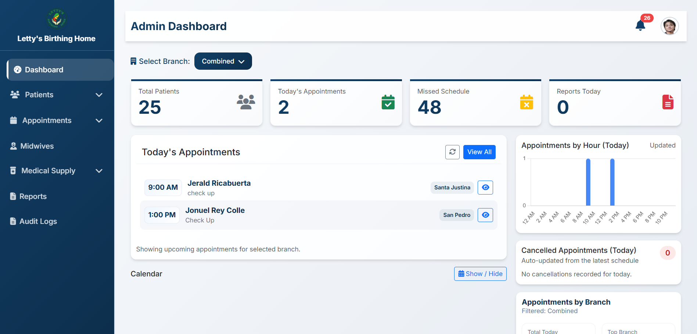
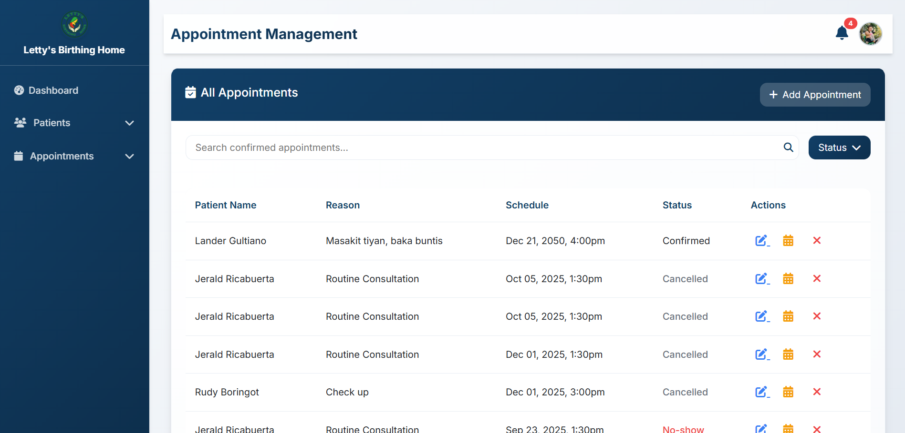

# Birthing Home Management System

A comprehensive web-based management system designed for birthing homes and maternal health facilities. This system streamlines appointment scheduling, patient management, and inventory tracking.

## 🚀 Features

### Core Modules
- **Appointment Management** - Schedule, track, and manage patient appointments with calendar integration
- **Patient Records System** - Secure storage and management of patient information and medical history
- **Inventory Management** - Track medical supplies, equipment, and medications with low-stock alerts
- **Staff Administration** - Manage staff accounts, roles, and access permissions

### Key Highlights
- Role-based access control (Admin, Staff)
- Real-time appointment scheduling and conflict detection
- Responsive design for desktop and mobile access
- Secure authentication and data encryption

## 📸 Screenshots

### Login


### Admin Dashboard


### Appointment Management


## 🛠️ Technologies Used

### Backend
- **Framework:** Laravel 12.x
- **Database:** MySQL

### Frontend
- **HTML5, CSS3, JavaScript**
- **Bootstrap 5** - Responsive UI framework
- **jQuery** - Dynamic interactions

## 📋 Prerequisites

Before installation, ensure you have:
- PHP 8.1 or higher
- Composer
- MySQL 5.7 or higher
- XAMPP
- Git

## 🔧 Installation

### 1. Clone the Repository
```bash
git clone https://github.com/lhadricabuerta/BirthingHomeManagementSystem.git
```

### 2. Install Dependencies
```bash
# Install PHP dependencies
composer install

### 3. Environment Configuration
```bash
# Copy environment file
cp .env.example .env

# Generate application key
php artisan key:generate
```

### 3. Configure Database
Edit `.env` file with your database credentials:
```env
DB_CONNECTION=mysql
DB_HOST=127.0.0.1
DB_PORT=3306
DB_DATABASE=birthing_home_db
DB_USERNAME=your_username
DB_PASSWORD=your_password
```

### 4. Run Migrations
```bash
# Create database tables
php artisan migrate

# Seed sample data (optional)
php artisan db:seed
```

### 5. Build Assets
```bash
npm run build
# or for development
npm run dev
```
Access the application at: `http://localhost:8000`

## 🔐 Security Features

- Password hashing with bcrypt
- CSRF protection on all forms
- SQL injection prevention through Eloquent ORM
- XSS protection
- Role-based access control (RBAC)
- Secure session management

## 🤝 Contributing

This is a capstone project for academic purposes. However, suggestions and feedback are welcome!

## 📄 License

This project is developed as part of academic requirements at Camarines Sur Polytechnic Colleges.

## 👨‍💻 Developer

**Jerald Ricabuerta**  
BS Information Technology Student  
Camarines Sur Polytechnic Colleges  

📧 Email: lhad.ricabuerta16@email.com 

## 🙏 Acknowledgments

- Camarines Sur Polytechnic Colleges - IT Department
- Project Advisers and Panel Members
- Birthing Home Partner Facility

---

⭐ If you find this project helpful, please consider giving it a star!

**Note:** This system is designed for educational purposes as part of a capstone project requirement.
